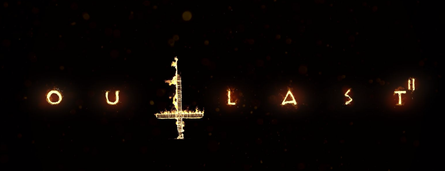
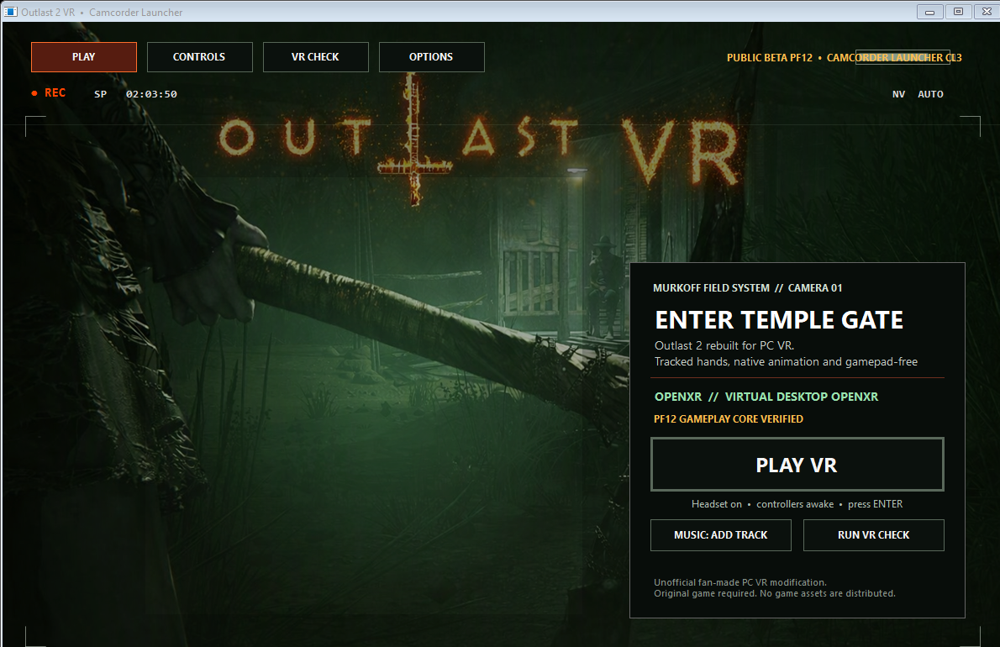

<p align="center">
  
</p>

# Outlast 2 VR — Public Beta 1

An unofficial PC VR conversion for Outlast 2 with full headset rendering,
Quest/Touch controller input, hybrid tracked arms, native character animations,
camcorder controls, comfortable VR menus, and gamepad-compatible interactions.



> **Important:** This mod does not include Outlast 2. You must own and install a
> legal PC copy. The project is not affiliated with or endorsed by Red Barrels.

## Download and install

Download `Outlast2VR-Beta1-Windows-x64.zip` from the
[latest GitHub release](../../releases/latest), then follow [INSTALL.md](INSTALL.md).

The short version: extract the complete ZIP into the folder containing
`Outlast2.exe`, normally:

```text
Steam\steamapps\common\Outlast 2\Binaries\Win64
```

Launch `Outlast2VR.exe`, put on the headset, and select **PLAY VR**.

## Features

- OpenXR PC VR rendering and head tracking
- Comfortable startup, menu, options, and loading-screen presentation
- Full-view VR gameplay with corrected native camera/culling direction
- Hybrid upper-body IK driven by tracked controllers
- Native Outlast 2 interaction and scripted-scene animations
- Native camcorder, night vision, zoom, batteries, recordings, and microphone
- Quest/Touch button mappings with physical gamepad fallback
- sRGB headset color mode and VR-safe graphics preset
- Desktop single-eye mirror suitable for recording
- Root-cellar bed progression correction

## Quest/Touch controls

| Control | Action |
|---|---|
| Left stick | Move; control movable objects after pressing X |
| Left-stick click | Sprint |
| Right stick left/right | Turn |
| Right stick up/down | Camcorder zoom |
| A | Jump |
| B | Crouch/crawl |
| X | Interact, pick up items, open doors, use switches, or start moving objects |
| Y | Reload camcorder battery |
| Hold Y | Apply a bandage |
| Right grip | Raise/lower camcorder |
| Right-stick click | Toggle night vision |
| Y + right-stick click | Toggle microphone |
| X + Y | Open recordings/inventory |
| A + B | Look behind |
| Menu button | Pause |
| Both stick clicks | Open VR settings/recenter controls |

## Compatibility

- Windows 10/11 x64
- OpenXR; Quest 3 with Virtual Desktop/VDXR is the primary tested setup
- Physical Xbox-style controllers remain supported
- Verified Outlast 2 executable: version `1.0.8767.0`, 36,192,256 bytes
- Verified executable SHA-256:
  `F7993204F4A865AAE46473A7B5AF59D6D0F1F8DD134158157CD95AA726554107`

Other OpenXR headsets and game revisions may work but are not yet considered
verified. Runtime hooks fail closed when executable signatures differ.

## Beta limitations

- Some scripted scenes temporarily return arm control to the game's authored
  animation and restore tracking afterward.
- The game can still display Xbox-style prompts for its original actions.
- Outlast 2 is an older UE3 title; isolated level-specific visibility issues may
  still exist. Report a repeatable location with the log and a headset capture.
- This is an intense horror game. Use the launcher comfort options, take breaks,
  and stop immediately if you feel unwell.

## Building from source

See [DEVELOPMENT.md](DEVELOPMENT.md). The repository builds the runtime proxy,
launcher, and 19 regression tests. Compiled binaries belong in GitHub Releases,
not in the source tree.

Maintainers can follow [GITHUB_SETUP.md](GITHUB_SETUP.md) to publish the source and
create a verified binary release without including original game files.

## License and trademarks

The mod source is available under the [MIT License](LICENSE). Third-party and
trademark information is in [THIRD_PARTY_NOTICES.md](THIRD_PARTY_NOTICES.md),
with the OpenXR redistribution terms in [OPENXR_LICENSE.md](OPENXR_LICENSE.md).
